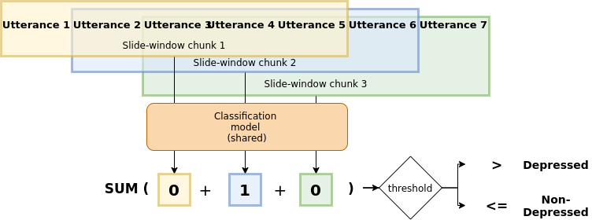

This repository contains code for training and using deep learning models for mental disorder detection in conversational domain.

## Install
The required libraries are:
- tensorflow2, keras
- numpy, nltk, sklearn, pandas

The full list of packages and versions I used is found in `requirements.txt` (may contain some unnecessary ones)

## Usage

See `scripts` folder. Main flow is precompute representation and then apply on your dataset.

## Model




## Publications

If using this resource, please cite the relevant papers (bib format will be provided as soon as possible):

 * Detecting early signs of depression in the conversational domain: The role of transfer learning in low-resource scenarios
    * Petr Lorenc, Ana Sabina Uban, Paolo Rosso, and Jan Šedivý, NLDB 2022
    
The code and algorithm was inspired by:
```
@InProceedings{10.1007/978-3-030-80599-9_27,
author="Uban, Ana Sabina
and Chulvi, Berta
and Rosso, Paolo",
title="On the Explainability of Automatic Predictions of Mental Disorders from Social Media Data",
booktitle="Natural Language Processing and Information Systems",
year="2021",
publisher="Springer International Publishing",
pages="301--314",
isbn="978-3-030-80599-9"
}
```
    
All experiment were conducted during internship (May - September 2021) of Petr Lorenc at Universitat Politècnica de València supervised by professor Paolo Rosso
